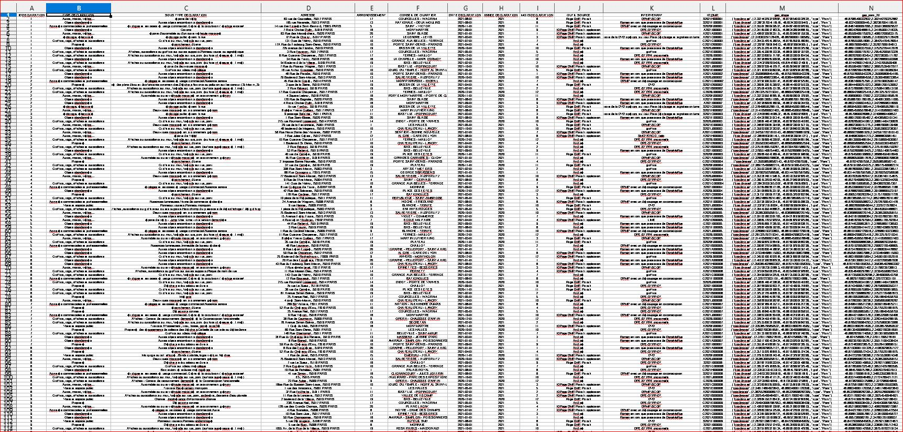

PROJET-Anomalies-signalees_Django
=
---
#### Site analysant les données sous forme de graphiques de l'application "Paris anomalie dans ma rue"
***

### ON PART DU PRINCIPE QUE VOUS AVEZ DEJA PYTHON 3.9 D'INSTALLÉ SUR VOTRE MACHINE

---

- ## LE FICHIER DE DONNEE **.CSV** TROP LOURD POUR GITUB,
- ## EST A RECUPERER A L'ADRESSE :
https://drive.google.com/drive/folders/1l3VUZDtZmmHV1GCpxEDITGLa4_27hE5v?usp=sharing

- ## ET A INSERER DANS VOTRE DOSSIER CLONE EN SUIVANT CETTE ARBORESCENCE :

    - ## ~/src/static/csv

___

#### ENONCE PROJET :

> Quelles sont les années pour lesquelles il y a le plus / le moins d’anomalies signalées par
arrondissement ?

> Quels sont les mois pour lesquels il y a le plus / le moins d’anomalie signalées, par type
d’anomalie ?

> Quel(s) arrondissement(s) comportent le plus / le moins d’anomalies signalées, par type
d’anomalie ?

***

* Représentation graphiques : diagrammes circulaires et histogrammes.

* Cartographie des données par choix (forme, couleur, échelle…) + récupération des coordonnées via Google map et clef d’autorisation

***
#### APERCU DES DONNEES :

